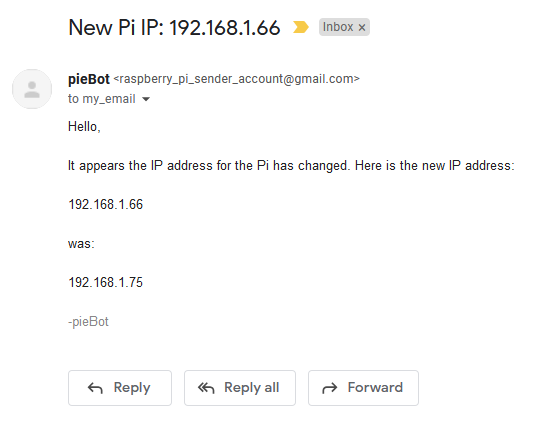
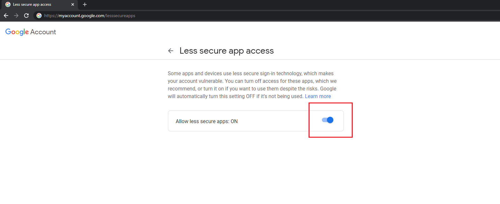
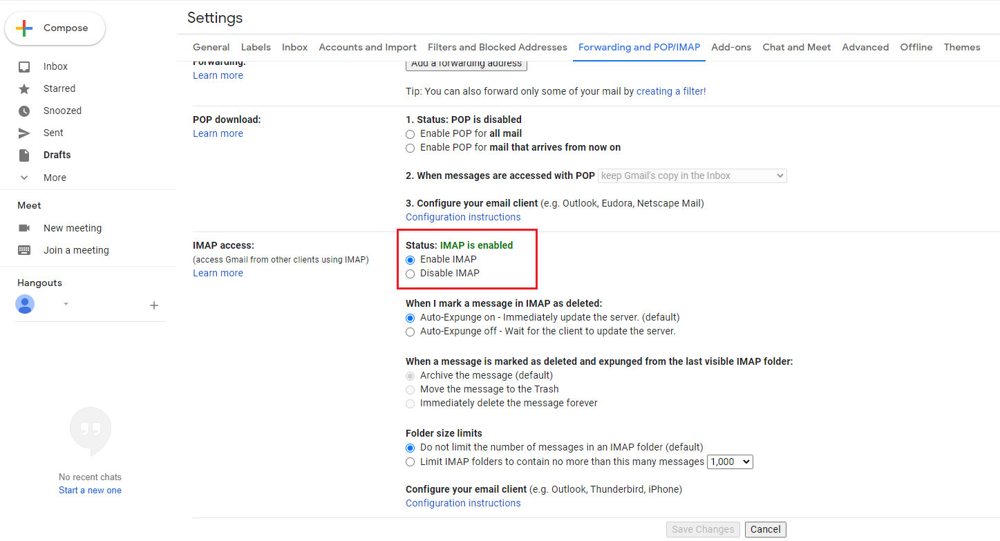
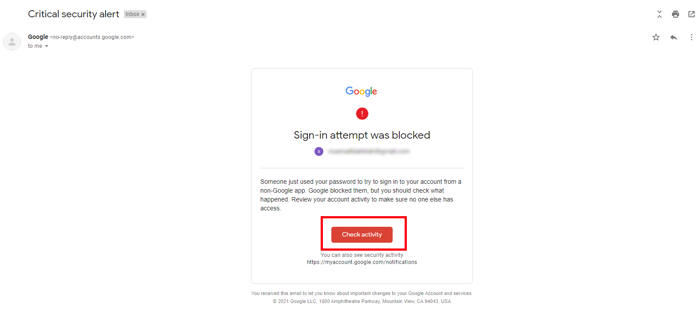
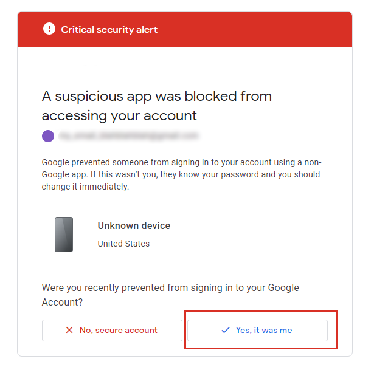

<!-- Use pandoc, grip, etcetera to read this file in CLI.-->

# PIIPE <!-- omit in toc -->

RaspberryPi IP Emailer


A script to email your RaspberryPi's IP address to you. Can be set to execute at boot and only emails when the IP address changes.



If you are using DHCP, the IP address of the RaspberryPI could potentially change each time it boots. In order to determine the address, one usually connects a monitor and obtains the IP address from boot screen. However, it is not always convenient to attach a monitor. This script will determine if the IP address has changed and if so, email the new IP address to a designated recipient.

Note: this script only works in Unix (or Windows WSL).

## Table of Contents <!-- omit in toc -->

- [Requirements](#requirements)
- [Setup](#setup)
  - [Email](#email)
- [Installation](#installation)
- [Technologies](#technologies)
- [Individual File Overview](#individual-file-overview)
- [Roadmap](#roadmap)
- [License](#license)

## Requirements

- RaspberryPi (any version)
  - With Python 3 or greater installed.
- At least one gmail account
- Git
  - If you want to `git clone` the scripts from Github via terminal

## Setup

### Email

This script uses the Gmail SMTP server. You can use some other SMTP server, but you might need to configure it yourself from the sender's settings. The steps below are for setting up the email account through Gmail. Two settings need to be relaxed in order for non-Gmail clients to send email. You probably want to use a secondary/spam Gmail account, because you need to provide plaintext password.

1. Log on to your sender Gmail account.
2. Visit [https://myaccount.google.com/lesssecureapps](https://myaccount.google.com/lesssecureapps) and toggle "Allow less secure apps" to "ON".

    

3. Visit your sender's Gmail settings and enable "IMAP".

    

## Installation

1. Make sure you have Python 3 installed on your RaspberryPi. If not, log on to your Pi and run:

   ```bash
   sudo apt-get install python3
   ```

2. Clone this repository using the URL on top right.

3. Open `.ip_checkrc` and modify the 3 fields:

    ```python
    # DO NOT DELETE THIS FILE.
   # Please enter your credentials below.
   # This is read by ip_check.py.

   # Account that will send the emails.
   sender_email = my_email@gmail.com

   # Password for the Gmail account that will send emails, in plain text.
   sender_password = my_password123

   # Anyone who will receive the email. It can be the same as the sender, but doesn't have to be. It could be another Gmail account you have that you want to receive emails.
   recipient_email = my_email@gmail.com
    ```

4. Then run `email_test.py`.

    ```bash
    ./email_test.py
    ```

    You might receive an email from Google in your sender email. This is normal. The script needs your permission to send emails. Click on "Check activity" and mark the unknown device as "Yes, it was me."

    

    

5. Now run `email_test.py` again, to see if you can receive the test email.

    ```bash
    ./email_test.py
    ```

    If you receive the email from the Pi, proceed to the next step. Otherwise, try to resolve any error messages. Makes sure your credentials are entered correctly in `.ip_checkrc`, and that your Gmail settings are correct above.

6. Run the `ip_check.py` script. This script will grab your IP address and store it to a local file. Hopefully, it should send you an email!

    ```bash
    ./ip_check.py
    ```

7. If you would like the script to run at reboot, enter this in your crontab. Where `$PWD` is YOUR path to this project's directory. REPLACE `$PWD` with your own path.

    ```bash
    @reboot sleep 30 && $PWD/ip_check.py
    ```

    For example, here is mine:

    ```bash
    @reboot sleep 30 && ~/code/piipe/ip_check.py
    ```

8. Reboot your Pi!

    ```bash
    sudo reboot
    ```

9. Wait a few minutes. It takes a while for its IP to setup. After a few minutes, you should receive the email! For testing purposes, you will receive an email for the next 10 times you run the script (without `-f` force tag). After that, you will only receive an email when the IP address changes.

## Technologies

This project is created with

- Python version: `3.8.5` (but any Python 3 version should be fine)
- RaspberryPi 3

## Individual File Overview

- [ip_check.py](ip_check.py) - Main program. Checks if IP address has changed and sends emails accordingly.
- [.ip_checkrc](.ip_checkrc) - IMPORTANT: You must edit this file and enter your Gmail account credentials in this file.
- [email_test.py](email_test.py) - Simple program to send an email. Used to test if email credentials/permissions are set properly.
- [example_crontab.txt](example_crontab.txt) - Example crontab to run script at reboot. Include your own path to the file. Instructions are in the text file.
- .ip_check_last_ip.txt - Stores the last IP address. Okay to delete (new file is created by `ip_check.py`). Lives in `~.`.
- .ip_check_count.txt - Stores number of times script has been ran for trial purposes. After 10 times, script will only send emails if IP has been changed or `-f` force parameter is used. Okay to delete (new file is created by `ip_check.py`). Lives in `~.`.
- [README.md](README.md) - readme.
- [README.txt](README.txt) - readme in plaintext.
- [uninstall.sh](uninstall.sh) - remove dot files

## Roadmap

- Add README.txt
- Move files to user's directories (rc file, etc)
- Move pip installs to requirements.txt
- Move packages installs to package manager so it is built-in
- Uninstaller

## License

This project falls under the MIT license.
